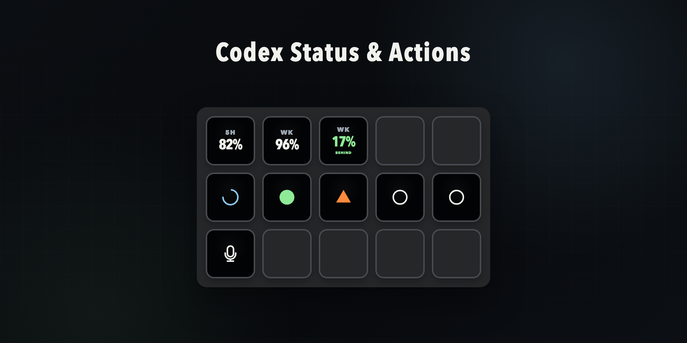

# Codex Status & Actions

[](https://github.com/alxbra/codex-status-actions/actions/workflows/ci.yml)
[](https://github.com/alxbra/codex-status-actions/releases/latest)
[](LICENSE)



Codex Status & Actions is an unofficial local Stream Deck plugin that provides task status, usage information, and dictation controls for Codex Desktop on macOS.

It includes three actions:

- **Codex Status** assigns recent Codex tasks to keys and shows their current state.
- **Codex Usage** shows remaining, used, or pace percentages for the usage windows available to the current account.
- **Codex Dictation** invokes the Toggle dictation shortcut configured in Codex.

## Requirements

- macOS 12 or newer
- Stream Deck 7.1 or newer
- Codex Desktop with its bundled Codex CLI
- A user-configured Toggle dictation shortcut when using Codex Dictation

## Installation

### Elgato Marketplace (recommended)

Open the Marketplace in the Stream Deck app, search for **Codex Status & Actions**, and select **Install**. Marketplace installations receive updates through Stream Deck.

### GitHub release

Download `com.alxbra.codex-status-actions.streamDeckPlugin` from the [latest GitHub release](https://github.com/alxbra/codex-status-actions/releases/latest), then open the file to install it in Stream Deck.

After installation, drag any of the three actions onto a Stream Deck profile. Status and Usage work without additional account setup because they use local Codex interfaces.

Enhanced approval detection is optional but recommended. Enable it from a Codex Status key's property inspector, trust the local status hooks, and restart Codex once. Hook changes are never trusted silently. Planning questions are detected without hooks, but approval waits may remain blue when enhanced detection is disabled.

Codex Dictation requires the same shortcut in both places:

1. Assign a shortcut under **Codex → Settings → Keyboard Shortcuts → Toggle dictation hotkey**.
2. Record that shortcut in the Codex Dictation property inspector.
3. Approve macOS keyboard-control access for Stream Deck if prompted on first use.

## Codex Status

Each Status key represents one local Codex task.

| Color         | State                                   |
| ------------- | --------------------------------------- |
| ⚪️ White/gray | Idle                                    |
| 🟢 Green      | Completed response not yet acknowledged |
| 🔵 Blue       | Working                                 |
| 🟠 Orange     | Waiting for an approval or answer       |
| 🔴 Red        | Task or integration error               |

The key uses a transparent background with a hollow idle circle, filled unread circle, animated working segment, approval triangle, or error circle with an X. It does not display task names or rank numbers.

Status keys use a stable, turn-driven queue:

- Initial positions follow current task recency.
- Starting a new turn moves that task to the first position.
- Progress updates and completions do not reorder keys.
- The order persists across Stream Deck and plugin restarts.
- Archived, ephemeral, and spawned subagent tasks are excluded.
- Each Stream Deck device ranks its tasks independently.

A single press selects the represented task without intentionally foregrounding Codex and acknowledges its green state. A second press within 500 ms also brings Codex forward. Codex may still activate itself while processing the first deep link; the plugin does not restore focus or use screen coordinates.

## Codex Usage

The Usage action reads the official Codex app-server rate-limit snapshot. It does not read the Codex authentication file or make private usage requests.

Each key can show:

- **Remaining:** percentage still available.
- **Used:** percentage already consumed.
- **Pace:** the difference from a linear usage forecast, shown as **Ahead** or **Behind**.

Single mode shows either the 5-hour or weekly window. Double mode shows both. Reset countdowns and refresh intervals are configurable, and usage can be refreshed manually from the property inspector.

Some accounts do not provide a 5-hour limit. In that case the 5-hour value displays `N/A`; this is not treated as an error. If a refresh fails after a successful request, the last values remain visible and are marked **Stale**.

## Codex Dictation

The Dictation action activates Codex and invokes its configured **Toggle dictation hotkey**. It supports two interaction modes:

- **Hold:** press to start and release to stop.
- **Toggle:** press once to start and again to stop.

Codex handles the microphone and transcription. The resulting text remains editable in the currently selected task and is never submitted automatically. The plugin does not use Codex's separate Hold-to-dictate shortcut and cannot observe Codex's internal microphone state; a recording indicator means the start shortcut was dispatched successfully.

## Privacy and security

This plugin is unofficial and is not affiliated with OpenAI or Elgato. It reads local Codex task data and uses Codex's local app-server interface. It does not read the Codex auth file, retain authentication tokens, record microphone audio, inspect dictated text, or send prompts and task contents to the plugin author.

Optional status hooks reduce Codex hook events to task ID, turn ID, and event name. Prompt text, questions, commands, tool input, transcripts, and file paths are not forwarded or logged. The helper exits successfully when Stream Deck is unavailable so it cannot block Codex.

See [Privacy](docs/PRIVACY.md) and [Security](SECURITY.md) for the full data and security model.

## Current limitations

- macOS and one local Codex installation only.
- Status supports only the stable, turn-driven assignment mode.
- Green is a plugin-local unread marker, not Codex Desktop's read state.
- Approval status clears on the next observable task activity because Codex does not expose a dedicated approval-resolved event.
- Task navigation relies on a local Codex deep link that may require updates after a Codex release.
- Codex must be restarted after installing or changing status hooks.
- Dictation always activates Codex and depends on a matching user-configured shortcut.

## Develop locally

Development requires Node.js 20.19 or newer and pnpm 10.

```sh
pnpm install
pnpm licenses:check
pnpm format:check
pnpm lint
pnpm typecheck
pnpm test
pnpm build
pnpm validate
pnpm run link
```

Restart the linked plugin after a change:

```sh
pnpm exec streamdeck restart com.alxbra.codex-status-actions
```

Run `pnpm watch` to rebuild and restart automatically, or `pnpm run pack` to create a `.streamDeckPlugin` file under `release/`.

## Contributing

Focused fixes and improvements are welcome. Read [CONTRIBUTING.md](CONTRIBUTING.md) before opening a pull request, keep new data access or automation behind a separate design proposal, and include the behavior and privacy impact of the change.

Use [GitHub Issues](https://github.com/alxbra/codex-status-actions/issues) for bugs and feature proposals. Report security issues through the process in [SECURITY.md](SECURITY.md).

## Documentation

- [Architecture](docs/ARCHITECTURE.md)
- [Privacy](docs/PRIVACY.md)
- [Security](SECURITY.md)
- [Troubleshooting](docs/TROUBLESHOOTING.md)
- [Third-party notices](THIRD_PARTY_NOTICES.md)

## License and attribution

Original code and artwork are licensed under [Apache-2.0](LICENSE). This repository does not contain or redistribute Codex Micro, Work Louder, or proprietary Codex Desktop code or assets.

Codex is a trademark of OpenAI. Stream Deck is a trademark of Elgato. This project is not affiliated with or endorsed by OpenAI, Work Louder, or Elgato.
